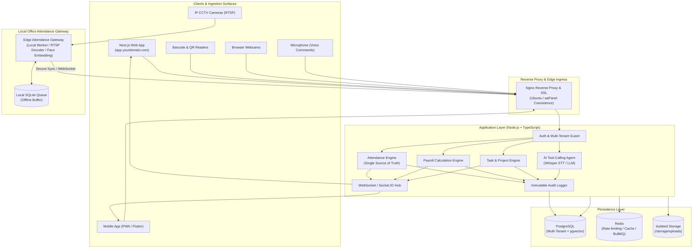
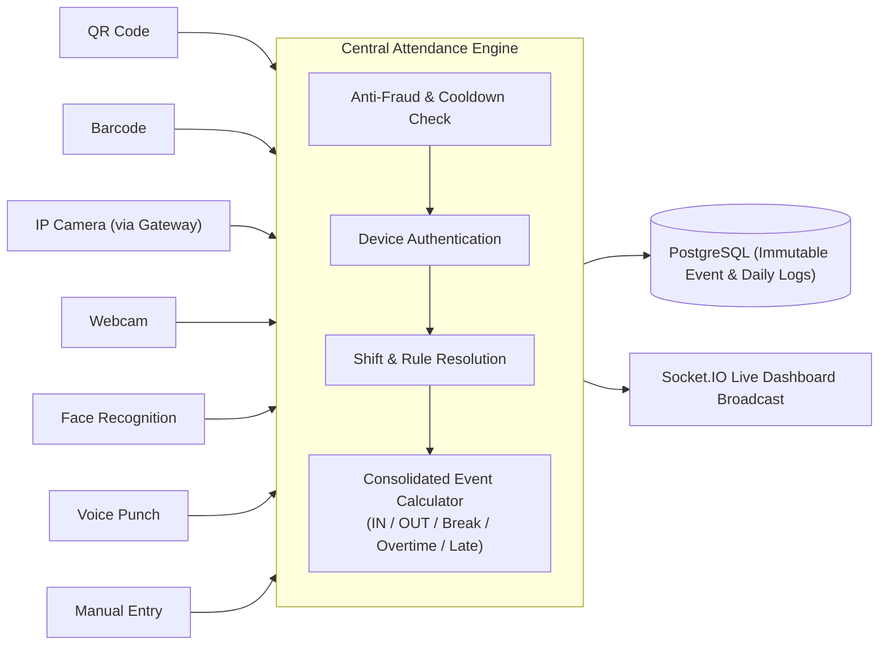
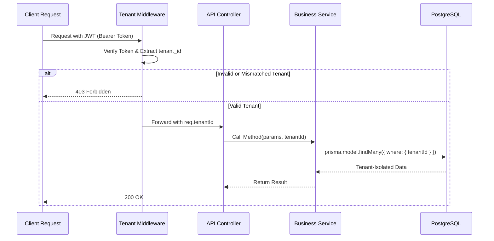

# AttendanceAI: System Architecture Specifications

## 1. High-Level System Architecture

The platform is designed as an enterprise-grade, multi-tenant SaaS architecture supporting concurrent attendance sources, real-time analytics, AI tool execution, task workflows, and payroll calculations.

---

## 2. Core Principle: The Central Attendance Engine

All attendance events regardless of origin—IP camera, webcam, QR code, barcode, voice, or manual punch—flow into **one central Attendance Engine**.

---

## 3. Multi-Tenancy & Data Isolation Model

Every tenant-scoped table features a mandatory `tenant_id` column.
Tenant isolation is enforced strictly at:
1. **Network / JWT Layer**: Incoming tokens bind each user to their `tenant_id` and assigned `company_id`/`branch_id`.
2. **Middleware Layer**: The `tenant.middleware.ts` rejects any request where the tenant context is missing or forged.
3. **Repository / Query Layer**: All Prisma database operations automatically scope queries with `{ where: { tenantId } }`.
4. **PostgreSQL RLS (Row Level Security)**: Optional defence-in-depth policy guarantees that database queries cannot return data belonging to another tenant.

---

## 4. Production Coexistence with Existing aaPanel Server

The host server already serves an active production website. The new SaaS platform runs in complete isolation:

| Dimension | Existing Website | New AttendanceAI Platform |
|---|---|---|
| **Domain** | `existing-domain.com` | `app.yourdomain.com` & `api.yourdomain.com` |
| **Database** | Existing DB on port 5432 | Dedicated DB: `attendance_ai_db` (dedicated user) |
| **Application Process** | Existing PHP / Node process | PM2 cluster / Docker container on port `3041` (API) & `3042` (Web) |
| **Reverse Proxy** | Main Nginx server block | Separate Nginx vhost configuration files |
| **Storage & Uploads** | Existing web root | `/www/wwwroot/attendance-ai/storage/` |
| **Logs** | Existing log files | `/www/wwwroot/attendance-ai/logs/` |

---

## 5. Technology Stack Summary

- **API Runtime**: Node.js v20+ / v24, TypeScript, Express.js with modular layered services.
- **Real-Time**: Socket.IO with Redis adapter for horizontal scaling.
- **ORM & Database**: Prisma ORM with PostgreSQL 15+, `pgvector` for conversational AI memory & document embeddings.
- **Validation**: Zod runtime schema validation on every request DTO.
- **Authentication**: JWT access tokens (15m expiration) + cryptographically secure rotating refresh tokens (7d) stored with hash verification.
- **Frontend**: Next.js 14 / React + TypeScript + modern enterprise design system.
