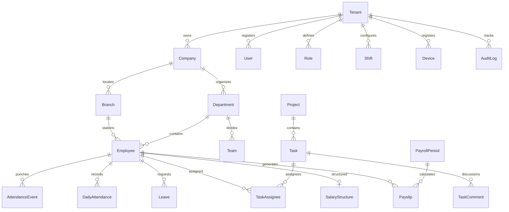

# Database Architecture & Schema Specifications

## 1. Overview & Multi-Tenancy Design

The **AttendanceAI** database is designed for multi-tenant scalability, transactional consistency, and fast query execution on high-volume time-series attendance records.

### Isolation Strategy
* Every tenant-owned table contains a mandatory `tenantId` indexed foreign key referencing `tenants(id)`.
* Compound indexes such as `[tenantId, employeeCode]`, `[tenantId, date]`, and `[tenantId, branchId]` ensure lightning-fast index scans and prevent full table scans across tenants.
* Soft-cascades and strict relational integrity prevent orphan records.

---

## 2. Entity Relationship Diagram (High-Level)



---

## 3. High-Volume Indexing Strategy

| Table | Index Columns | Purpose |
|---|---|---|
| `attendance_events` | `(tenantId, employeeId, timestamp)` | Fast individual attendance timeline queries |
| `attendance_events` | `(tenantId, timestamp)` | Real-time live attendance feed filtering |
| `attendance_events` | `(tenantId, source)` | Audit and device distribution analytics |
| `daily_attendance` | `(tenantId, employeeId, date)` (Unique) | Single consolidated record per employee per day |
| `daily_attendance` | `(tenantId, branchId, date)` | Branch-level daily attendance dashboard counters |
| `daily_attendance` | `(tenantId, status)` | Filter absent, late, or present employees instantly |
| `employees` | `(tenantId, employeeCode)` (Unique) | Unique employee lookup within company |
| `employees` | `(tenantId, branchId)` | Filter branch rosters |
| `employees` | `(tenantId, status)` | Active employee roster queries |
| `audit_logs` | `(tenantId, entity, entityId)` | Entity revision history audit trail |
| `audit_logs` | `(tenantId, createdAt)` | Chronological compliance logs |

---

## 4. Attendance Events Partitioning Recommendation

For deployments scaling past 50,000 employees with millions of punch events per month, PostgreSQL native declarative partitioning by `RANGE (timestamp)` is recommended:
```sql
CREATE TABLE attendance_events_y2026m09 PARTITION OF attendance_events
    FOR VALUES FROM ('2026-09-01 00:00:00') TO ('2026-10-01 00:00:00');
```
Prisma maps directly to the parent partitioned table without code changes.
