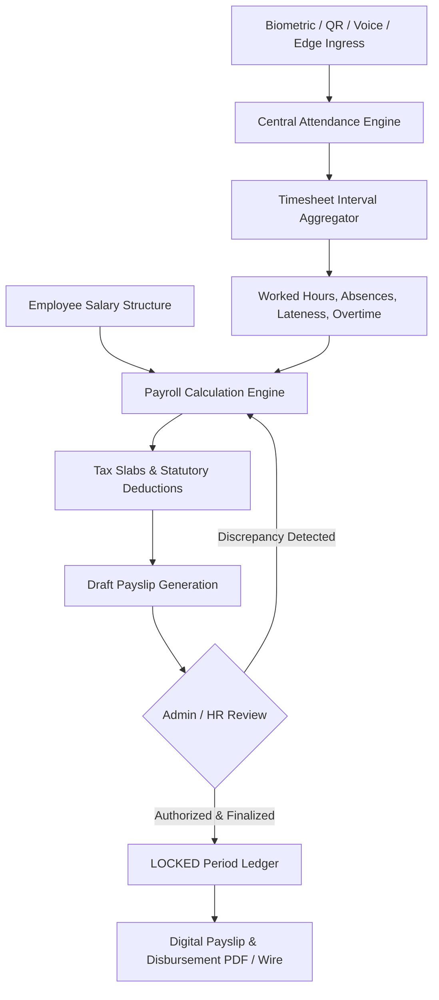
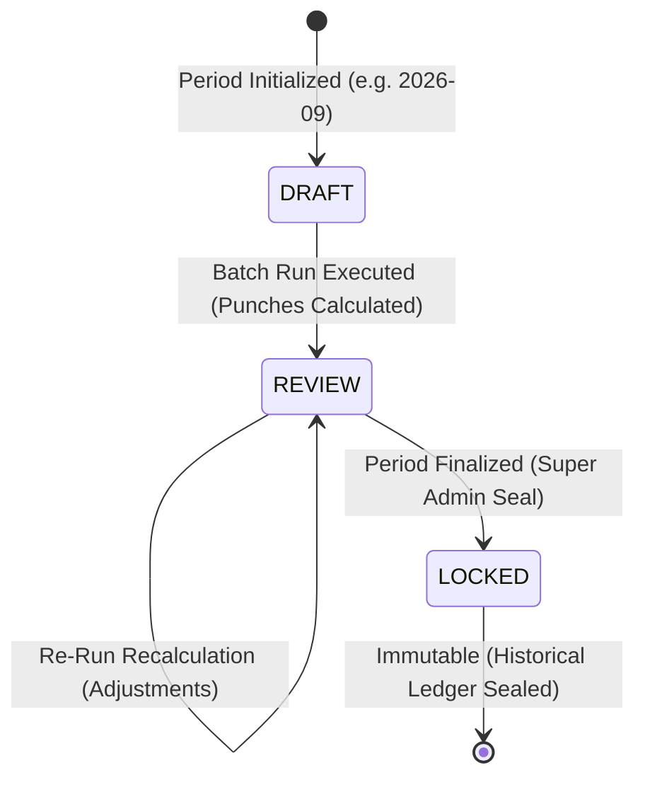

# Phase 7: Enterprise Payroll & Automated Salary Engine

The **AttendanceAI Enterprise Payroll Subsystem** establishes an automated, attendance-reconciled compensation pipeline. It continuously bridges raw biometric punches, shift schedules, overtime approvals, and leaves with progressive tax slabs, statutory provident funds, and immutable digital payslips.

---

## 1. Architectural Overview



---

## 2. Core Mathematical Formulas

The calculation engine enforces deterministic, zero-float-drift financial arithmetic:

### 2.1 Base Rates
$$\text{Daily Rate} = \frac{\text{Base Salary}}{30}$$

$$\text{Hourly Rate} = \frac{\text{Daily Rate}}{8} = \frac{\text{Base Salary}}{240}$$

### 2.2 Overtime Calculation
Overtime hours must be flagged as approved by supervisors. Approved overtime is compensated at a statutory $1.5\times$ overtime multiplier:

$$\text{Overtime Pay} = \text{Approved OT Hours} \times \text{Hourly Rate} \times 1.5$$

### 2.3 Attendance Deductions
1. **Unpaid Absence Penalty**:
   $$\text{Absence Penalty} = \text{Absent Days} \times \text{Daily Rate}$$

2. **Lateness Penalty Rule**:
   Every 3 instances of late arrival to a shift incur a half-day ($0.5$) salary deduction:
   $$\text{Lateness Penalty} = \left\lfloor \frac{\text{Late Days}}{3} \right\rfloor \times (0.5 \times \text{Daily Rate})$$

3. **Total Attendance Deduction**:
   $$\text{Attendance Deductions} = \text{Absence Penalty} + \text{Lateness Penalty}$$

### 2.4 Gross Salary
$$\text{Gross Salary} = \text{Base Salary} + \text{Housing Allowance} + \text{Transport Allowance} + \text{Medical Allowance} + \text{Other Allowances} + \text{Overtime Pay}$$

### 2.5 Progressive Income Tax Slabs
Tax is computed progressively on monthly taxable income ($\text{Gross Salary} - \text{Provident Fund}$):

| Monthly Bracket (USD) | Marginal Tax Rate | Base Cumulative Tax | Calculation Formula |
|:---|:---:|:---:|:---|
| **$0.00 – $1,000.00** | $0\%$ | $0.00 | Exempt |
| **$1,000.01 – $2,500.00** | $5\%$ | $0.00 | $(\text{Taxable} - 1,000) \times 0.05$ |
| **$2,500.01 – $5,000.00** | $10\%$ | $75.00 | $75.00 + (\text{Taxable} - 2,500) \times 0.10$ |
| **$5,000.01 – $10,000.00** | $20\%$ | $325.00 | $325.00 + (\text{Taxable} - 5,000) \times 0.20$ |
| **Above $10,000.00** | $35\%$ | $1,325.00 | $1,325.00 + (\text{Taxable} - 10,000) \times 0.35$ |

### 2.6 Statutory Provident Fund (PF)
$$\text{Provident Fund} = \text{Base Salary} \times 0.05 \quad (5\%)$$

### 2.7 Total Deductions & Net Payout
$$\text{Total Deductions} = \text{Income Tax} + \text{Provident Fund} + \text{Attendance Deductions} + \text{Custom Fixed Deductions}$$

$$\text{Net Salary} = \text{Gross Salary} - \text{Total Deductions}$$

---

## 3. Payroll Lifecycle & Immutability Ledger

Payroll cycles transition through three deterministic states:



- **DRAFT**: Period opened. Salary structures configured.
- **REVIEW**: Timesheet integration executed. Payslips calculated and ready for HR audit. Re-runs are permitted.
- **LOCKED**: Signed off by authorized personnel. **Any subsequent modifications or retroactive biometric attendance punches are strictly blocked from mutating locked historical payslips.**

---

## 4. API Specification

### 4.1 Define or Update Employee Salary Structure
- **Method**: `POST`
- **Path**: `/api/v1/payroll/salary-structure`
- **Headers**: `Authorization: Bearer <ADMIN_OR_HR_TOKEN>`
- **Request Body**:
  ```json
  {
    "employeeId": "emp-uuid-001",
    "baseSalary": 5200.00,
    "housingAllowance": 800.00,
    "transportAllowance": 300.00,
    "medicalAllowance": 250.00,
    "otherAllowances": 0.00,
    "customDeductions": 0.00,
    "currency": "USD",
    "effectiveDate": "2026-09-01"
  }
  ```
- **Response**: `200 OK`

### 4.2 Fetch Employee Salary Structure
- **Method**: `GET`
- **Path**: `/api/v1/payroll/salary-structure/:employeeId`
- **Response**: `200 OK`

### 4.3 Create Payroll Period
- **Method**: `POST`
- **Path**: `/api/v1/payroll/periods`
- **Request Body**:
  ```json
  {
    "name": "September 2026 Monthly Payroll",
    "startDate": "2026-09-01",
    "endDate": "2026-09-30"
  }
  ```
- **Response**: `201 Created`

### 4.4 Execute Batch Payroll Run
- **Method**: `POST`
- **Path**: `/api/v1/payroll/periods/:periodId/run`
- **Response**:
  ```json
  {
    "success": true,
    "data": {
      "periodId": "period-uuid",
      "processedCount": 22,
      "totalGross": 139500.00,
      "totalNet": 118240.50,
      "totalTax": 14210.25,
      "status": "REVIEW"
    }
  }
  ```

### 4.5 Lock & Finalize Payroll Period
- **Method**: `POST`
- **Path**: `/api/v1/payroll/periods/:periodId/lock`
- **Response**:
  ```json
  {
    "success": true,
    "data": {
      "periodId": "period-uuid",
      "status": "LOCKED",
      "lockedAt": "2026-09-07T03:30:00Z"
    }
  }
  ```

### 4.6 List Payslips for Period
- **Method**: `GET`
- **Path**: `/api/v1/payroll/periods/:periodId/payslips`
- **Response**: Array of detailed payslip records with itemized allowances, deductions, overtime, and net take-home salary.
