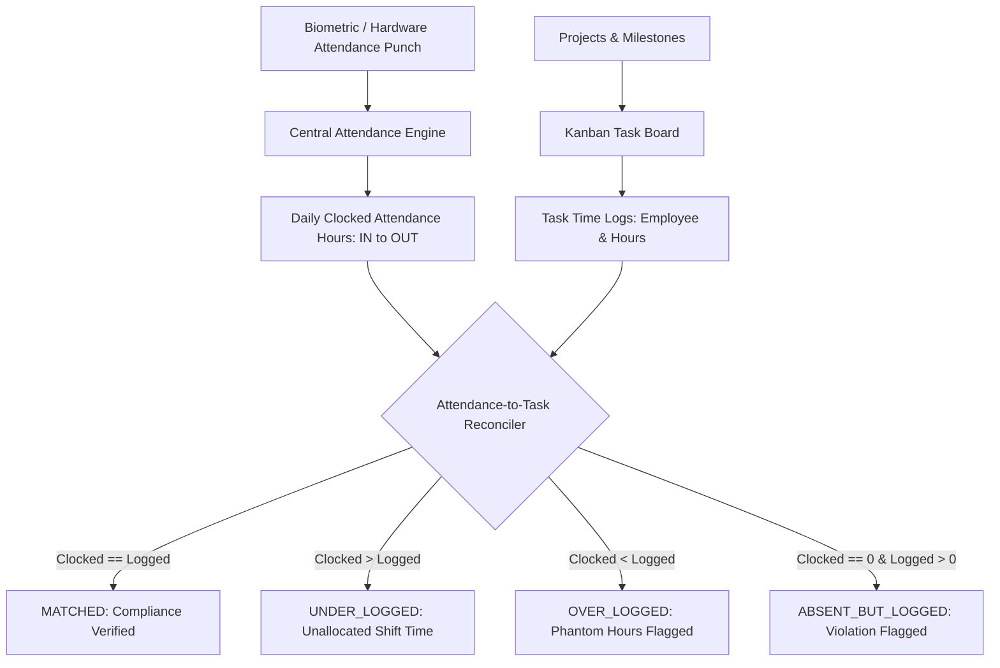

# Phase 8: Task & Project Management Subsystem

The **AttendanceAI Task & Project Management Subsystem** bridges agile project task workflows with the physical workforce attendance engine. It empowers teams to organize tasks through interactive Kanban boards, manage sprints, and verify that hours logged to projects are reconciled against verified biometric clock-in intervals.

---

## 1. Architectural Overview



---

## 2. Core Capabilities

### 2.1 Multi-Tenant Projects & Milestones
- Multi-branch project scoping (`tenantId`, `branchId`).
- Milestone deadline tracking with budget vs actual hour analysis.

### 2.2 Interactive 4-Column Kanban Lifecycle
Tasks transition across 4 deterministic states:
1. **TODO / Backlog**: Pending assignment or sprint activation.
2. **IN_PROGRESS**: Actively worked on by the assigned staff member.
3. **IN_REVIEW**: Submitted for team lead or supervisor quality review.
4. **DONE / Verified**: Completed, verified, and reconciled with timesheets.

### 2.3 Attendance-to-Task Reconciliation
The platform enforces physical attendance verification for logged work:
- If an employee logs project hours on a day they were marked **ABSENT** by the Central Attendance Engine, the system flags an `ABSENT_BUT_LOGGED` compliance violation.
- Eliminates phantom hours and guarantees accurate cost accounting.

---

## 3. API Specification (`/api/v1/tasks`)

### 3.1 List Projects
- **Method**: `GET`
- **Path**: `/api/v1/tasks/projects`
- **Response**: Array of projects with statuses, budget hours, and completion metrics.

### 3.2 Create Project
- **Method**: `POST`
- **Path**: `/api/v1/tasks/projects`
- **Request Body**:
  ```json
  {
    "name": "Mobile Workforce PWA",
    "code": "PRJ-MOB",
    "description": "Cross-platform mobile attendance client"
  }
  ```

### 3.3 List Tasks
- **Method**: `GET`
- **Path**: `/api/v1/tasks?projectId=PRJ-MOB`
- **Response**: Array of tasks filtered by project.

### 3.4 Create Task
- **Method**: `POST`
- **Path**: `/api/v1/tasks`
- **Request Body**:
  ```json
  {
    "projectId": "proj-001",
    "title": "Calibrate RTSP facial embedding threshold",
    "priority": "HIGH",
    "status": "TODO",
    "estimatedHours": 8,
    "assignedEmployeeId": "emp-001",
    "dueDate": "2026-09-25"
  }
  ```

### 3.5 Move / Transition Task Status (Kanban)
- **Method**: `PATCH`
- **Path**: `/api/v1/tasks/:taskId/status`
- **Request Body**:
  ```json
  {
    "status": "IN_PROGRESS"
  }
  ```

### 3.6 Log Task Time & Reconcile
- **Method**: `POST`
- **Path**: `/api/v1/tasks/time-logs`
- **Request Body**:
  ```json
  {
    "taskId": "task-101",
    "employeeId": "emp-001",
    "date": "2026-09-07",
    "hours": 4.5,
    "notes": "Completed facial vector matching benchmark"
  }
  ```

- **Method**: `GET`
- **Path**: `/api/v1/tasks/reconciliation?employeeId=emp-001&date=2026-09-07&clockedHours=8.0`
- **Response**:
  ```json
  {
    "employeeId": "emp-001",
    "date": "2026-09-07",
    "attendanceClockedHours": 8.0,
    "taskLoggedHours": 4.5,
    "differenceHours": -3.5,
    "complianceStatus": "UNDER_LOGGED"
  }
  ```
